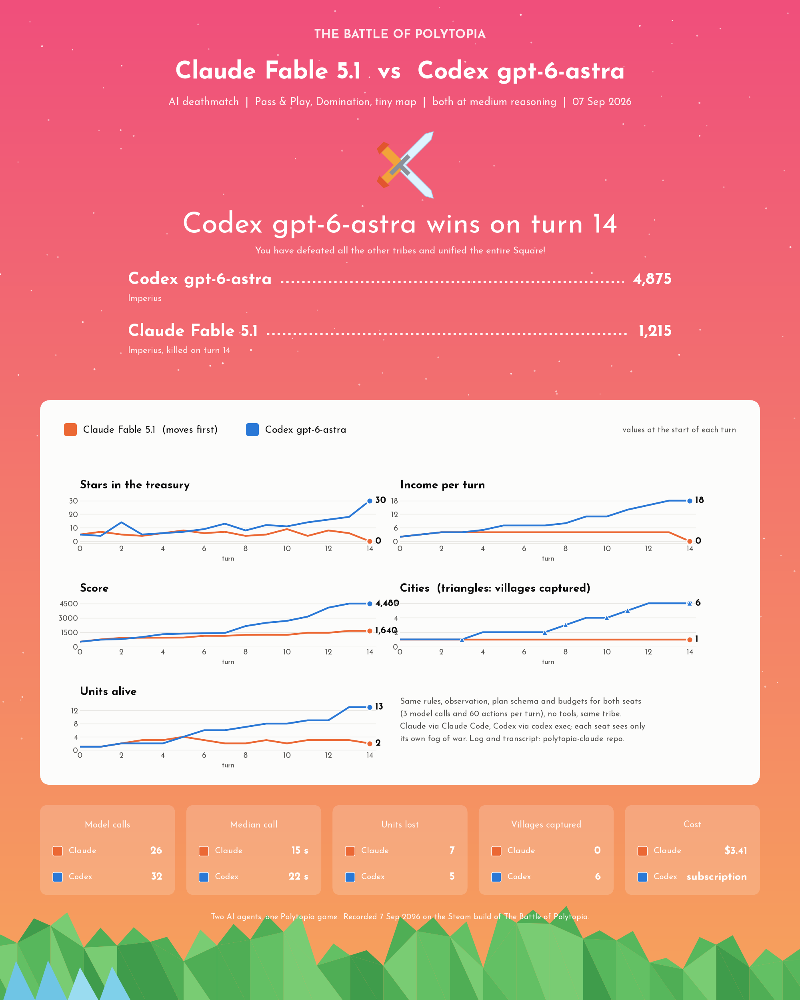

# polytopia-claude

Frontier AI models playing *The Battle of Polytopia* against the game's bots and against each other, on the
real Steam build, with exact game state in and legal actions out.

A PolyMod plugin inside the game exposes the fog-filtered `GameState` and every legal command over a local
socket. A Python harness turns that into a ~900-token text observation, asks a model for a whole turn as a
JSON plan, executes it through the game's own command path, and logs everything. Three model backends run on
their consumer subscriptions rather than API billing: **Claude** through headless Claude Code, **Codex**
through `codex exec`, and **Grok** through xAI's Grok Build CLI. Two of them can share one offline
Pass & Play game and fight to elimination.

## Results so far

Domination mode, tiny 11x11 map, Imperius, one game each. Details, transcripts and per-turn logs in
[`docs/RESULTS.md`](docs/RESULTS.md) and [`docs/samples/`](docs/samples/).

| Game | Matchup | Result | Turns | Wall time |
|---|---|---|---|---|
| 1 | Claude Opus 5 vs the game's Normal bot | **Claude won** | 26 | 36 min |
| 2 | Claude Opus 5 vs the game's Normal bot | bot won | 26 | 35 min |
| 3 | Claude Opus 5 vs Codex gpt-6-astra | **Codex won** | 18 | 30 min |
| 4 | Claude Fable 5.1 vs Codex gpt-6-astra | **Codex won** | 14 | 24 min |
| 5 | Claude Fable 5.1 vs Codex gpt-6-astra | **Codex won** | 14 | 23 min |
| 6 | Grok 4.6 vs Codex gpt-6-astra | **Codex won** | 10 | 53 min |

All model-vs-model games were played at medium reasoning effort on both seats, with the challenger moving
first. The pattern in every loss is the same: the challenger falls behind on village captures by mid-game,
Codex out-expands, then out-produces (Giants, Catapults, Archer lines) and rolls the map.



## How it works

```
The Battle of Polytopia (Steam, Windows)          harness/ (Python 3.11+)
  BepInEx 6 + PolyMod
  └─ mod/ClaudeBridge ── JSON over TCP :9876 ──►  client → observe → planner (model CLI) → runner → logger
       state + legal actions   ◄── action ──      play_domination.py / play_deathmatch.py / play_game.py
```

- **`mod/ClaudeBridge`** (C#, PolyMod plugin). Serializes the local seat's view of the game (explored tiles,
  units, cities, techs, stars) plus every command the engine's own option generators and `IsValid` accept,
  each as a ready-to-send action with damage previews and costs. Executes actions through
  `ClientBase.SendCommand`, the path the UI uses, so animations and saves stay consistent. Dismisses popups
  the way a tap would, starts and resumes games from the menu, and drives the Pass & Play seat handoff
  (overlay, recap replay, seat switch). Refuses every online game type.
- **`harness/polytopia_bridge/observe.py`**. State to text: header, objective, an ASCII map with one
  three-character cell per tile, city and unit lines, and a numbered legal-action list the model picks from
  by index, so it can never invent an illegal move.
- **`planner.py`**. One model call plans a whole turn: `{commentary, actions, notes}` under a JSON schema.
  `commentary` streams to the terminal as it is written, `actions` are legal-action indices resolved back to
  action keys (the bridge renumbers after every command), `notes` come back next turn as the model's memory.
  A plan that omits "end turn" means "run these, then ask me again". At most three calls per turn.
- **`runner.py`**. The turn loop: budgets, skipped and dependent steps, fixed policies for city rewards and
  peace requests, capture sweeps, per-seat state for two-agent games, void on tool use.
- **Backends.** `claude_stream.py` (Claude Code, `--json-schema`, streamed deltas), `codex_stream.py`
  (`codex exec --output-schema`, tool features disabled, isolated working directory), `grok_stream.py`
  (Grok Build `--json-schema --system-prompt-override`, every built-in tool removed, one agent turn per
  call). All three return the same result contract; `make_planner("codex:gpt-6-astra:medium")` builds one.
- **Instructions.** `rules.md` is mechanics only; `strategy_domination.md` is the rush strategy. Every seat
  gets the same text: Claude and Grok as a system prompt, Codex as `AGENTS.md`.

## Model vs model: the deathmatch

```powershell
cd harness
python scripts/play_deathmatch.py                                                # Opus 5 vs gpt-6-astra, Claude first
python scripts/play_deathmatch.py --p1 grok:grok-4.6:medium --p2 codex:gpt-6-astra:medium
python scripts/play_deathmatch.py --p1 claude:claude-fable-5-1:medium --p2 codex:gpt-6-astra:medium --first p2
python scripts/record_match.py -- scripts/play_deathmatch.py ...                 # same, screen-recorded
python scripts/match_card.py logs/<game>.jsonl --out ../docs/samples/<game>-card.png
```

One offline Pass & Play (hotseat) Domination game, two human seats, no bots. The bridge serves whichever seat
is at the keyboard, with its own fog of war, and the harness routes each seat's turn to its planner. Both
seats get identical instructions, observation, schema and budgets (3 model calls and 60 actions per turn),
the same fixed reward and peace policy, the same tribe, and no tools; each seat sees only its own state and
notes. Any tool use by a seat voids the game. Exit code 0 or 1 says which planner won, 2 undecided, 3 void.

Polytopia has no replay for offline games (replays are server-side, online only), so `record_match.py`
captures the game window with ffmpeg for the whole match, and `match_card.py` renders a Polytopia-styled
stats card (stars, income, score, cities, units per turn, plus calls, latency and cost) from the log.

Known asymmetries, recorded with each result: where the instructions sit (system message vs `AGENTS.md`),
each CLI's hidden preamble, what "medium" reasoning means to each vendor, and structured-output mechanics.
The design went through review rounds with Codex before implementation; `docs/CODEX_REVIEWS.md` lists every
point and what was done with it.

## Claude vs the game's bots

```powershell
cd harness
python -m pytest -q                                                    # 99 offline tests against recorded states
python scripts/play_domination.py                                      # Tiny Domination game vs 1 Normal bot, Opus 5
python scripts/play_domination.py --difficulty Easy --model claude-sonnet-5 --effort low
python scripts/play_game.py --new --agent random --opponents 1 --map-size 11 --max-turns 5   # random baseline
python scripts/run_eval.py --games 5 --difficulties Easy,Normal --agents random,claude-code:claude-opus-5
```

`play_domination.py` shows the turn header and map, the model's commentary as it is written, the parsed plan,
every action with the bridge's verdict, and a per-turn footer with calls, latency and cost. `play_game.py`
and `run_eval.py` are the older per-action agent (one model call per action, API or Claude Code) and the
Easy/Normal/Hard ladder.

## Setup

Windows with the Steam build of the game. [`docs/SETUP_WINDOWS.md`](docs/SETUP_WINDOWS.md) has the pinned
versions and every step: BepInEx 6 + PolyMod, .NET 6 SDK, `dotnet build -c Release` (which packages the mod
into `<game>\Mods\ClaudeBridge.polymod`), a portable Python, and the model CLIs (Claude Code, Codex, Grok
Build) signed in on their subscriptions. The game window must be open; the bridge lives inside it and
listens on `127.0.0.1:9876`. [`docs/PROTOCOL.md`](docs/PROTOCOL.md) is the wire protocol, including the
hotseat handoff.

## Repository layout

| Path | What |
|---|---|
| `mod/ClaudeBridge/` | the PolyMod plugin (`Plugin.cs` turn watcher and protocol, `StateSerializer.cs`, `LegalActions.cs`, `CommandCodec.cs`, `ActionExecutor.cs`) |
| `harness/polytopia_bridge/` | `client.py`, `observe.py`, `planner.py`, `runner.py`, the three backends, `console.py`, `logger.py`, `rules.md`, `strategy_*.md` |
| `harness/scripts/` | `play_deathmatch.py`, `play_domination.py`, `record_match.py`, `match_card.py`, `play_game.py`, `run_eval.py`, `bridgectl.py`, `smoke.py` |
| `harness/tests/` | offline tests with states recorded from the real bridge and real CLI runs (`fixtures/`) |
| `docs/` | results, transcripts and cards (`samples/`), protocol, setup, review rounds, the original plan and the Grok runbook |

## Findings worth knowing

- Turn-level planning beats per-action decisions: one call per turn with a rolling notes field gave coherent
  multi-turn play at roughly $0.07 per call on Claude Code.
- The engine is honest but subtle: the first state of a turn can arrive before income lands, a city reward
  can register after an accepted end turn, the hotseat client rewinds and replays the previous turn as a
  recap, and commands apply synchronously once the client's action loop is stopped. All of it is handled in
  the bridge and runner and covered by tests.
- Grok 4.6 at medium effort thinks for about 100 seconds per turn; Claude and Codex take 15 to 22.

## Scope and safety

Offline only. The bridge acts in single-player games and in the offline Pass & Play mode used for the
deathmatch, refuses every online `GameType`, and there is no Steam-account automation. That refusal is
deliberate and is the one line that keeps this an offline experiment: removing it to use the bridge in
matchmaking or other online games would be cheating against real players, and is not something this project
supports. Midjiwan's terms of service cover automation broadly; this is personal, offline use on the
author's own copy of the game.
